<div align="center">
    <h1>Proyecto 7. Aplicación Full Stack de CE<h1>
</div>
<p align="center">
  <a href="https://skillicons.dev">
    
  </a>
</p>

<div align="center">
    
    
    
</div>


##  🏨 Introducción
En este proyecto, el objetivo fue construir una aplicación de E-commerce.

El proyecto consta de un backend y un forntend.

## Tabla de Contenidos
1. [Requisitos y Dependencias](#)  
2. [Instalación](#️)  
3. [Capturas de pantalla del FrontEnd](#)
4. [Vercel](#)  

##  ✅ Requisitos y Dependencias
  Dependenciass: 
  - emotion/react
  - emotion/styled
  - fontsource/roboto
  - mui/icons-material
  - mui/material
  - axios
  - react
  - react-dom
  - react-router-dom
  
  Desarrollador Dependencias
  - eslint/js
  - types/react
  - types/react-dom
  - vitejs/plugin-react
  - eslint
  - eslint-config-prettier
  - eslint-plugin-prettier
  - eslint-plugin-react
  - eslint-plugin-react-hooks
  - eslint-plugin-react-refresh
  - globals
  - prettier
  - vite


##  ⚙️ Instalación
1. **Clonar el repositorio:**
   ```
   FRONTEND
   git clone https://github.com/MriquelmeCPHCJA/DONA-T-FRONTEND

   BACKEND
   git clone https://github.com/MriquelmeCPHCJA/DONA-T-BACKEND

   ```
2. **Acceder al directorio del proyecto:**
   ```
   cd DONA-T-FRONTEND
   ```
3. **Instalar las dependencias:**
   ```
   npm install
   ```
4. **Configurar el archivo `.env`:**
   Crear un archivo `.env` con los siguientes contenidos:
   ```
   VITE_BACKEND_URL=http://localhost:3000/api
   ```
5. **Ejecutar la aplicación:**
   ```
   npm run dev
   ```
## ✅ Capturas de pantalla del FrontEnd

### Portada


### Lista de Productos

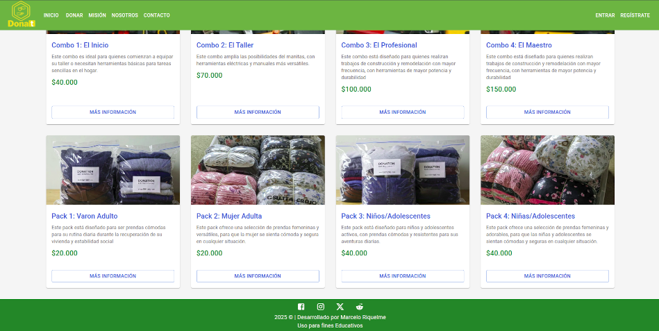

### Detalle Producto (no logeado)

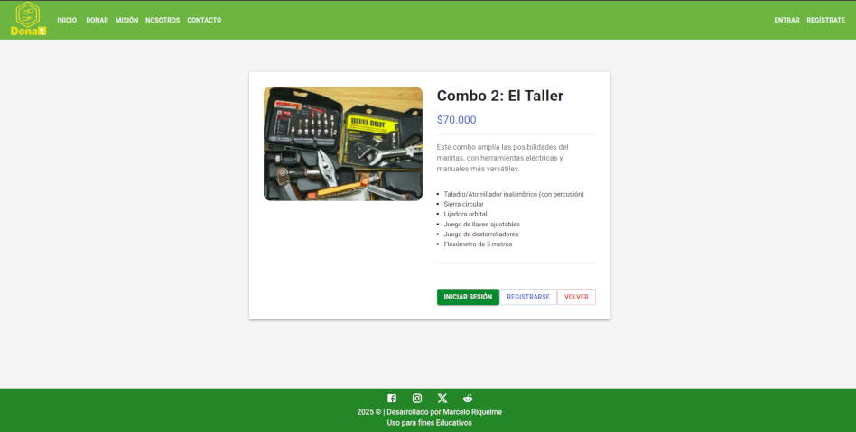

### Registro Nuevo usuario

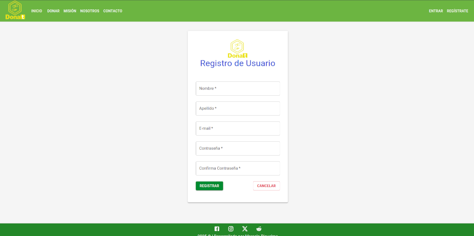

### Login usuario

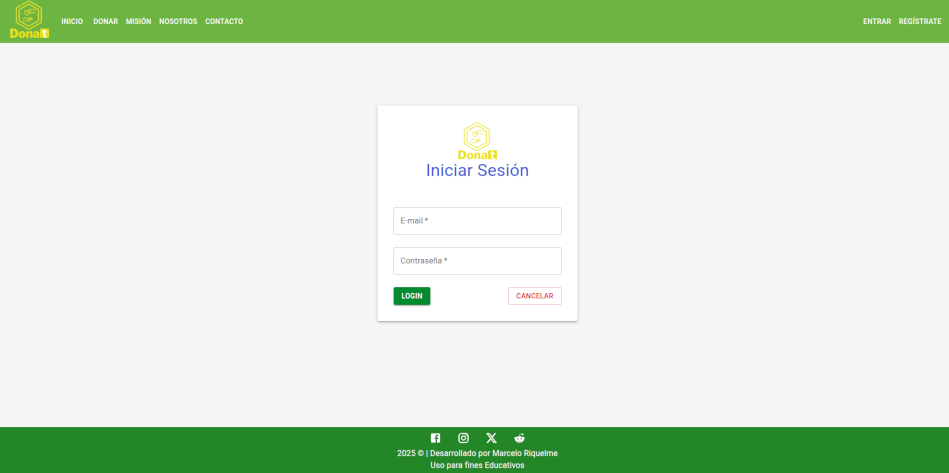

### Menú Usuario

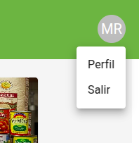

### Perfil Usuario

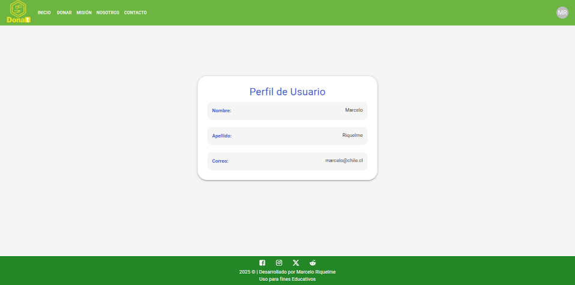

### Detalle Producto (logeado)

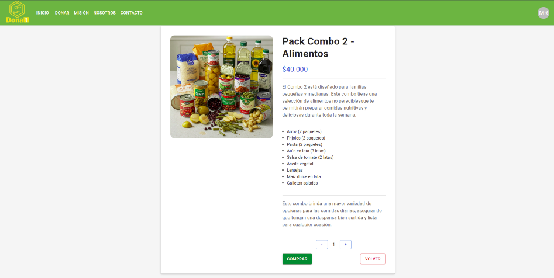

### Pago Stripe

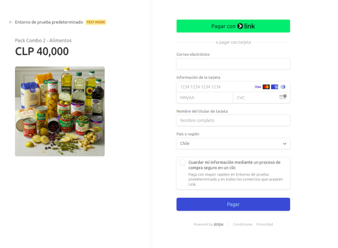

### Pago Exitoso

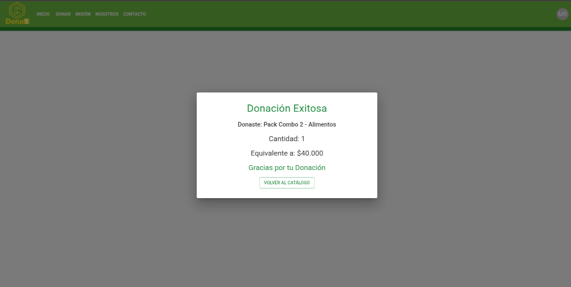

### Pago No realizado

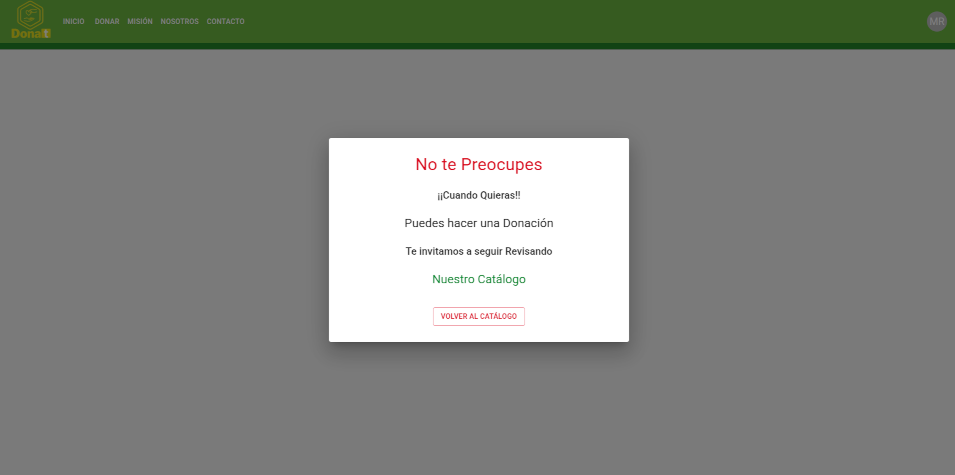

### Contacto

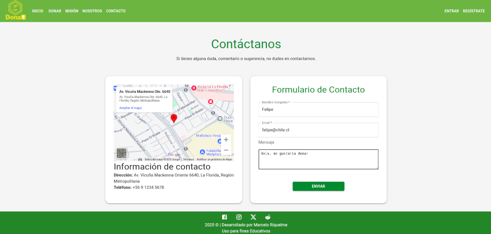
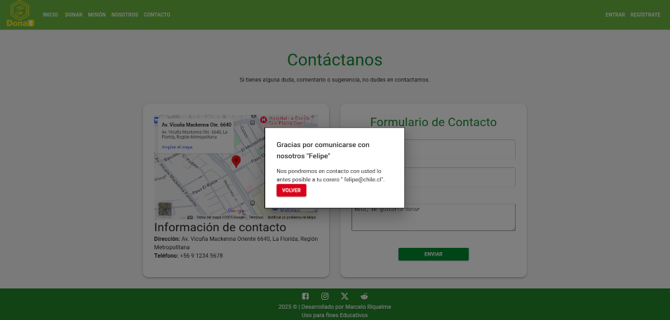

### Misión

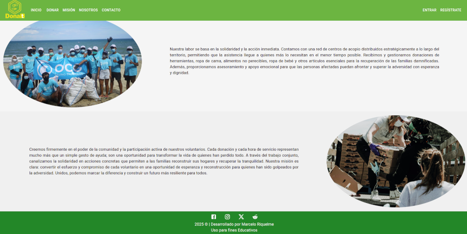

### Nosotros

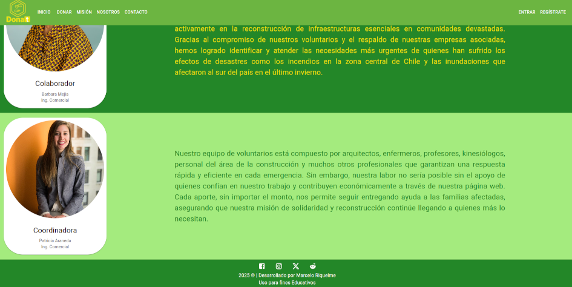


#### **Características**

- React+Vite
- Material UI
- Responsivo

## 🌎 **Vercel**

Se desplegó el FrontEnd en Vercel, puedes acceder en:

```
https://dona-t.vercel.app/
```

## 📧 Contácto
**Marcelo Riquelme**

**Email**: luriquelme.dwfs1@bootcampudd.cl